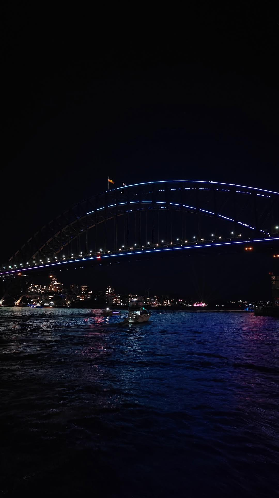
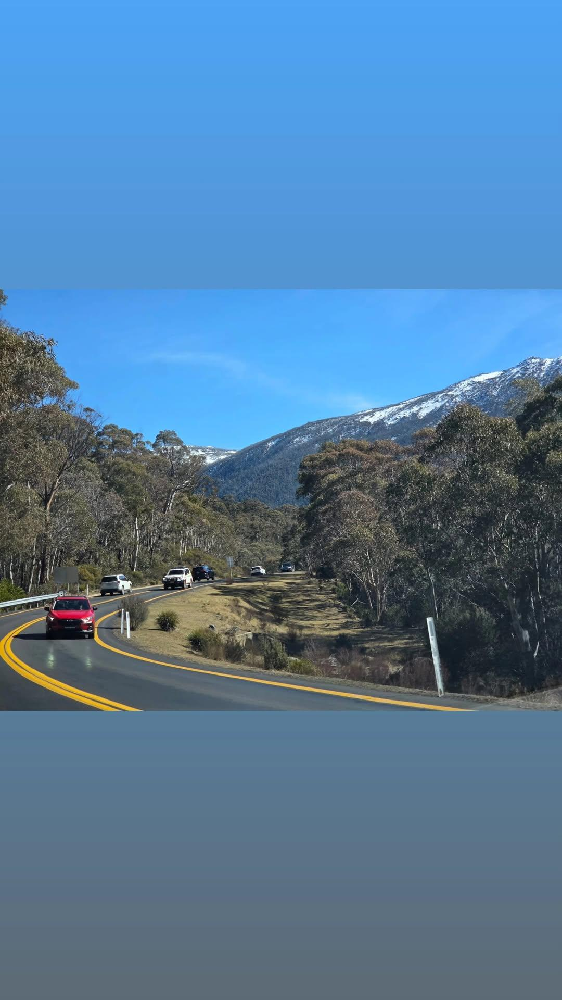

<b>Hello there, I am Harshith Kumar  </b>

I am a seconnd year student at UNSW, pursuing Masters in Information Technology. I am well adept at implementing Frontend and Backend technlogies across variety of disciplines - from personal projects all the way to a developer for a startup. In my spare time, I enjoy trying out different cuisines and love travelling and taking photos on my mobile.

⚒️ Skills

📸 My photography

  
  
  
  

  
  
  
  
  

